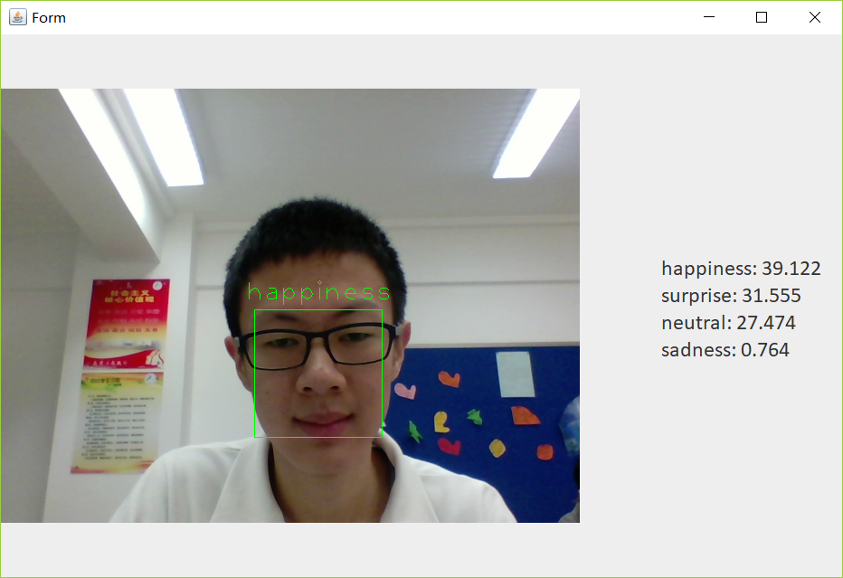
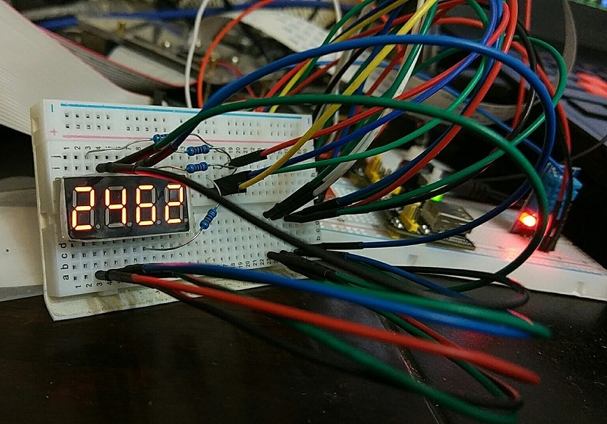

# Pi-alpha-robot-misc
A collection of raspberry pi and alpha robot (alpha 1s & 1pro) projects

#### Alpha 1 pro movement control demo
<video src="src/demo/Movement Control demo.mp4" controls></video>

#### Alpha 1 pro emotion response demo
<video src="src/demo/Emotion Response demo.mp4" controls></video>

#### Emotion recognition
This one uses Face++'s API

#### Display temperature and humidity on the 4-digit-8-segment display
